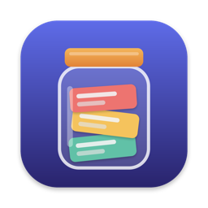
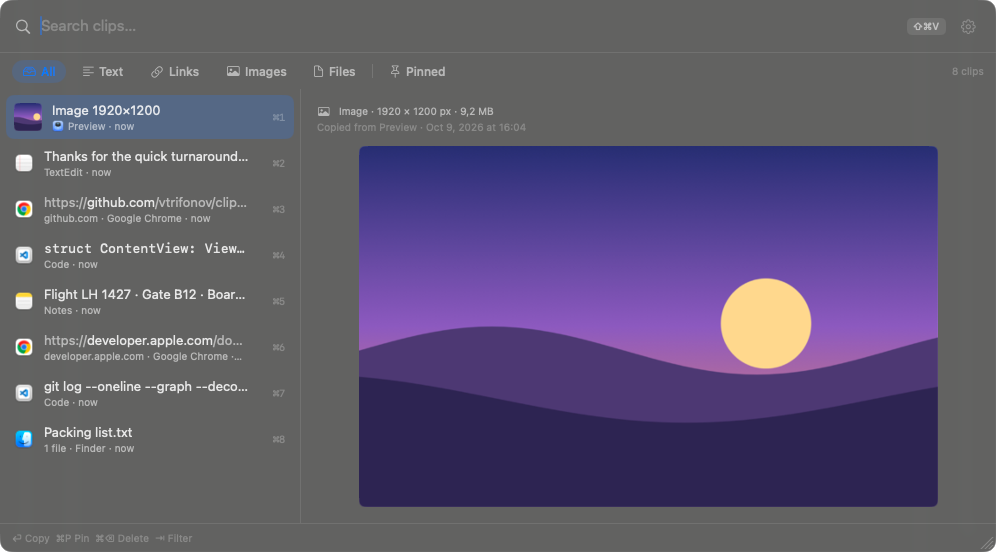
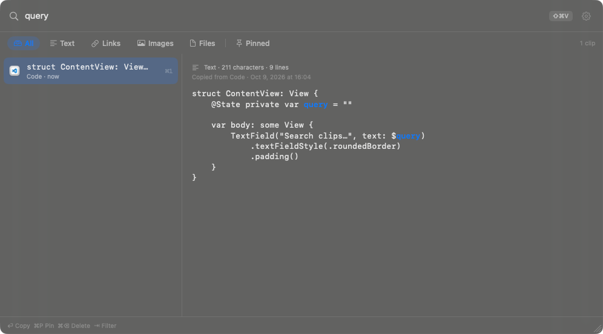

<p align="center">
  
</p>

<h1 align="center">Clipjar</h1>

<p align="center">
  <strong>A fast, keyboard-first clipboard history for the macOS menu bar.</strong><br>
  Press a hotkey, type a few letters, press Return — the clip lands in the app you were using.
</p>

<p align="center">
  <a href="../../releases/latest"></a>
  
  
  <a href="LICENSE"></a>
</p>

<p align="center">
  
</p>

## Why Clipjar

- **Instant.** ⇧⌘V opens the panel where you are, already focused on search. ⏎ pastes. ⌘1–⌘9 paste the first nine clips.
- **Everything you copy.** Plain and rich text, links, images and files from Finder — each with its source app and a full preview.
- **Private by design.** No network code, no accounts, no analytics. Passwords that apps mark as concealed are never saved, and password managers are ignored out of the box.
- **Stays out of the way.** Lives in the menu bar, never steals focus from the app you're pasting into. Drag the panel anywhere and resize it from the corner; it remembers the size.

## Search that understands what you copied

<p align="center">
  
</p>

Matches are highlighted as you type. Narrow things down with:

| Query | Finds |
| --- | --- |
| `"Hello, Clipjar"` | the exact phrase |
| `@Safari example.com` | clips copied from Safari containing `example.com` |
| `is:text` `is:link` `is:image` `is:file` `is:pinned` | clips of one type |

Or press ⇥ to cycle through the All, Text, Links, Images, Files and Pinned chips.

## Features

- **Pins** keep the clips you reuse at hand. Pinned clips are never pruned.
- **Preview** the whole text, the full-size image or the file list before you paste.
- **Retention you control:** keep 200 to 10,000 clips (or unlimited), and drop clips older than a day, a week, a month or a year.
- **Privacy controls:** pause capture (indefinitely or for 15 minutes) and ignore specific apps.
- **Configurable hotkey:** ⇧⌘V by default. Change or clear it in Settings.
- **Accessible:** full keyboard control, VoiceOver labels, and support for Reduce Motion and Increase Contrast.

## Keyboard map

| Key | Action |
| --- | --- |
| ↑ / ↓ | Select the previous / next clip |
| ⌘↑ / ⌘↓ | Jump to the first / last clip |
| Page Up / Page Down | Move up / down by a page |
| ⏎ | Paste the selected clip (copies it when pasting is off or not allowed) |
| ⌥⏎ | Copy the selected clip without pasting |
| ⌘1 – ⌘9 | Paste clip 1–9 |
| ⌘P | Pin or unpin the selected clip |
| ⌘⌫ | Delete the selected clip (press twice for a pinned clip) |
| ⌘Z | Undo the last delete, while its notice is showing |
| ⇥ / ⇧⇥ | Next / previous type chip |
| Esc | Clear the search, then close the panel |
| ⌘, | Open Settings |
| ⌘W | Close the panel |

## Install

1. Download `Clipjar.zip` from the [latest release](../../releases/latest) and unzip it.
2. Move `Clipjar.app` to your Applications folder **before you open it for the first time**. When an app runs
   straight from Downloads, macOS runs it from a randomised read-only location (App Translocation), and the
   permissions you grant it don't stick.
3. Open it the first time:
   - right-click `Clipjar.app` ▸ **Open**, then click **Open** again; or
   - on macOS 15 and later, open it once, then go to System Settings ▸ Privacy & Security and click
     **Open Anyway**; or
   - in Terminal: `xattr -dr com.apple.quarantine /Applications/Clipjar.app`

Clipjar is ad-hoc signed, not notarized, so macOS asks you to confirm the first launch.

### Accessibility

To paste for you, Clipjar needs Accessibility access: System Settings ▸ Privacy & Security ▸ Accessibility ▸ turn
on Clipjar. Clipjar uses it only to send ⌘V to the app you were using. Without it, Return copies the clip and you
paste it yourself.

Each build is signed ad hoc, so after an update macOS no longer recognises the old permission. Select Clipjar in
the Accessibility list, remove it with **−**, and add it again. Or run this and relaunch Clipjar:

```sh
tccutil reset Accessibility com.vtrifonov.clipjar
```

### Clipboard access

On macOS 15.4 and later, macOS may ask whether Clipjar can read the clipboard. Choose **Always Allow**. If you
denied it, turn it back on in System Settings ▸ Privacy & Security; Clipjar shows a notice until you do.

## Privacy

- Everything stays on this Mac. Clipjar has no network code and no analytics.
- History is stored unencrypted on disk, readable only by your user account.
- Content that apps mark as concealed or transient (for example, passwords from password managers) is never saved.
- Apps on the ignore list are never captured. Common password managers are on it by default.
- The history folder is excluded from Time Machine backups.
- Deleted clips are scrubbed from the database file, not just hidden.

History lives in `~/Library/Application Support/Clipjar`. If the database is ever damaged, Clipjar starts with a
fresh history and keeps the old file there with `.corrupt-` in its name. You can delete those copies.

## Build from source

You need Xcode with Swift 6.2 or later.

```sh
make test      # run the test suite
make install   # build, sign and copy Clipjar.app to /Applications
```

`make app` builds a universal `build/Clipjar.app`, and `make zip` packages it as `build/Clipjar.zip`.
`swift scripts/make-icon.swift` redraws `Resources/AppIcon.icns`.

## Uninstall

Quit Clipjar from its menu bar icon, delete `Clipjar.app` from Applications, then delete
`~/Library/Application Support/Clipjar`.

## License

MIT — see [LICENSE](LICENSE).

Clipjar uses [GRDB.swift](https://github.com/groue/GRDB.swift) and
[KeyboardShortcuts](https://github.com/sindresorhus/KeyboardShortcuts), both MIT-licensed. Their notices are in
[THIRD_PARTY_NOTICES.md](THIRD_PARTY_NOTICES.md) and ship inside `Clipjar.app/Contents/Resources`.
